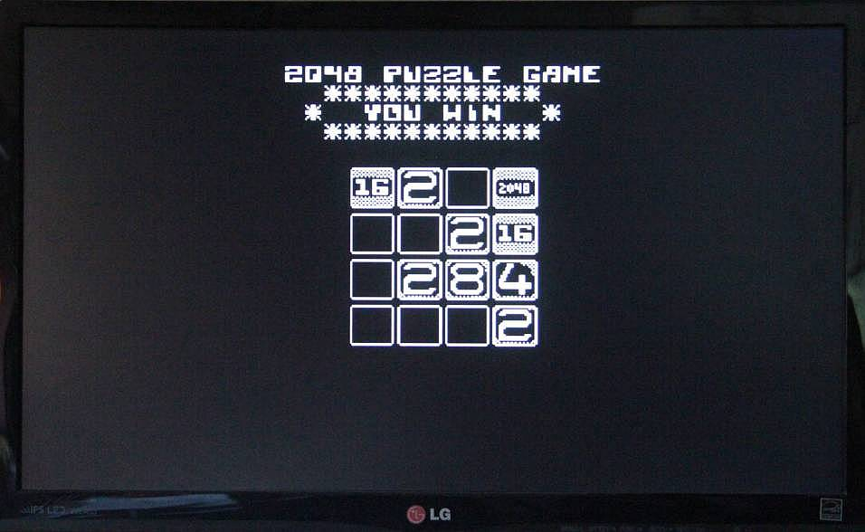

# 2048 for the Minimal 64

Another simple game for the minimal 64.
You can find everything about the Minimal 64 here:

https://github.com/slu4coder/The-Minimal-64-Home-Computer

It is a simple variant of the classic game 2048. The goal of the puzzle is to reach the tile with the value 2048.

## Controls

|Buttons     |                     |
|:----------:|:--------------------|
|Cursor keys |moves the cursur     |
|or I,J,K,M  |                     |
|N           |restart the game     |
|Q           |return to Minimal OS |

More about the game on Wikipedia:

https://en.wikipedia.org/wiki/2048_(video_game)

