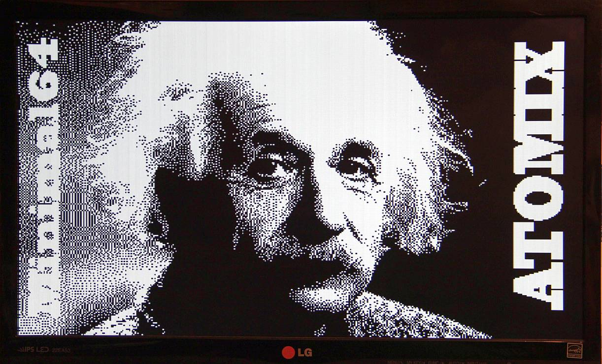
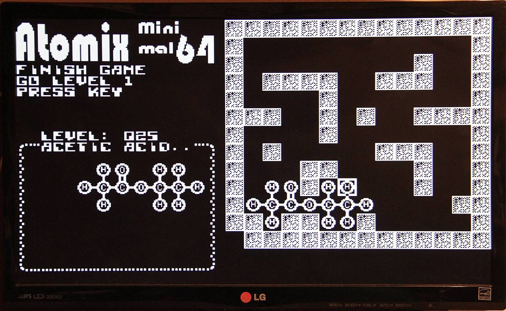

# Atomix for the Minimal 64

My second game for the Minimal 64.
You can find everything about the Minimal 64 here:

https://github.com/slu4coder/The-Minimal-64-Home-Computer

The game is a Atomix clone. In the first version there are 15 playable levels.

Level 25 of 25 (21 no bonus levels)

## Controls

|Buttons     |                          |
|:----------:|:-------------------------|
|Cursor keys |moves the cursur          |
|space or CR |lock/unlock atom to move  |
|R           |restart current level     |
|- or PgDn   |back one level            |
|+ or PgUp   |one level forward         |

Atomix ist ein Spiel aus dem Jahr 1990, das neben einem DOS-PC auch auf anderen Systemen verfügbar war.

https://en.wikipedia.org/wiki/Atomix_(video_game)

