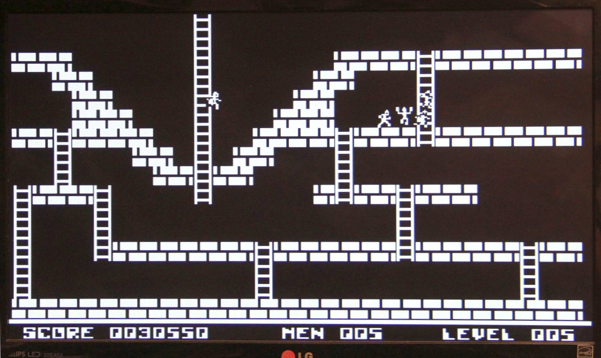
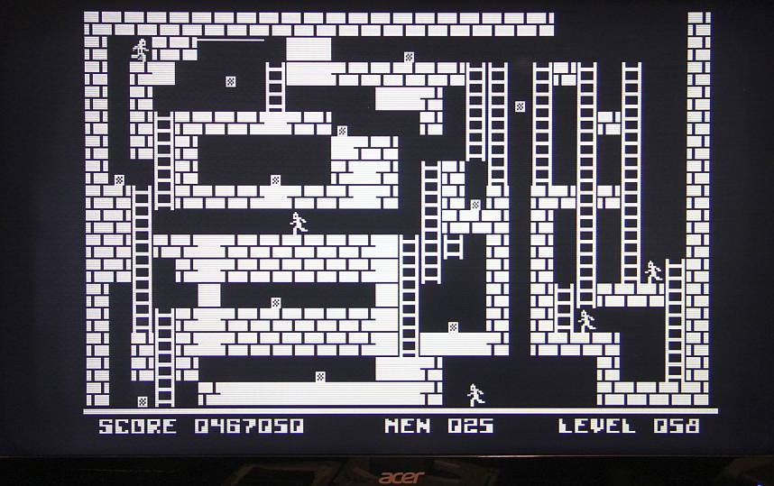

# Lode Runner for the Minimal 64

Here is my first attempt to implement the game "Loderunner" on the Minimal 64.
As a starting point I used the version for the BBC Micro from here:

https://github.com/0xC0DE6502/lode-runner-disassembled

Unfortunately, this version does not use the enemy AI as I know it from Apple][.
A source that is very close to the original can be found here:

https://github.com/SimonHung/LodeRunner_TotalRecall

It can be easily played in the browser using the keyboard:

https://loderunnerwebgame.com/game/

The Minimal 64 version currently includes 100 levels from "Classic Lode Runner".

to do:
- load all 150 levels from SSD
- High score
- Improve catcher AI

## Controls

| Buttons    |                          |
|:----------:|:-------------------------|
|Cursor keys | moves the player         |
| a          | give up level            |
| y          | digging left             |
| x          | digging right            |
|            |                          |

## Picture

Since the hunters' algorithm is not like Apple's ][, the game requires a slightly different strategy. But it is playable, I have already made it past level 60. 

