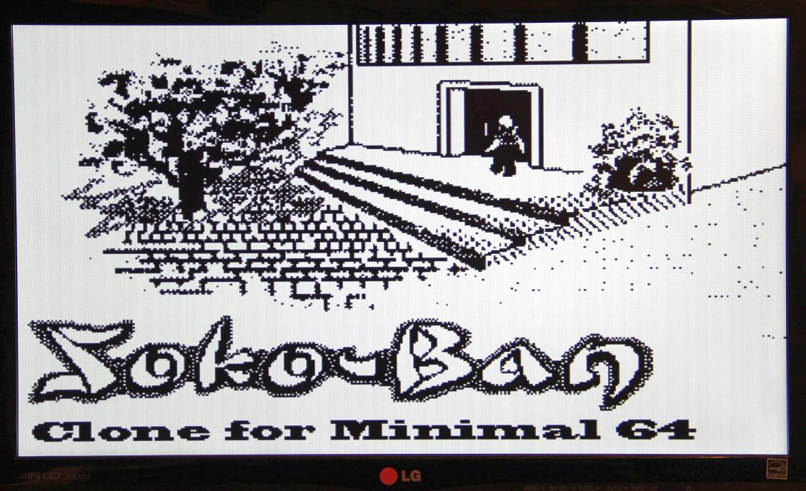
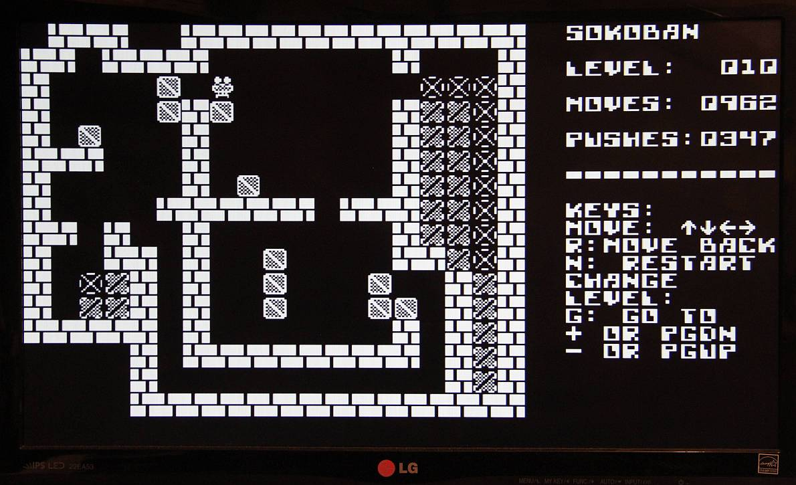

# Sokoban for the Minimal 64

My first attempt to write a game for the Minimal 64.
You can find everything about the Minimal 64 here:

https://github.com/slu4coder/The-Minimal-64-Home-Computer

The game is a Sokoban clone. In the first version there are 90 playable levels.

Level 10 of 90

## Controls

|Buttons    |                                            |
|:---------:|:-------------------------------------------|
|Cursor keys|moves the player in four possible directions|
|N          |restart current level                       |
|G          |starts a level 1..90                        |
|- or PgDn  |back one level                              |
|+ or PgUp  |one level forward                           |
|R          |undo last move                              |

I played Sokoban at the end of the 1980s on the XT PC with CGA graphics. You can still find it on YouTube today.

https://www.youtube.com/watch?v=i_WmVBwEE4U

